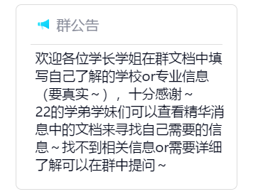

# 鞍山一中·报考指南

## 这是什么？

在这里获得关于大学报考的信息

### 为什么网站这么卡？

这个问题的确很让人恼火，目前我也在探索更好的优化方式。

可能的解决方案有

1：尽可能在电脑端的浏览器打开。

2：出现reload界面时刷新。

3：如果可能的话，魔法上网能够提供不错的浏览体验。

### 如何添加词条？

目前支持以下的几种方式

1：在群中的在线文档中编辑。我们会定期收集表格中的信息，并更新到wiki。

2：直接在群里@刘发中，并上传您的介绍文件。我会提取文件中的信息，然后更新到wiki。

### 招募

虽然说这是一个简单的wiki，但是由于faii又菜又懒，而且只了解关于工科的专业，所以需要大佬捞捞

如果您有兴趣支持我的工作，可以帮助faii完成包括专业分类，文本录入，wiki维护，页面排版等等工作，可以加入下面的群聊。欢迎各位大佬加入捏QAQ

